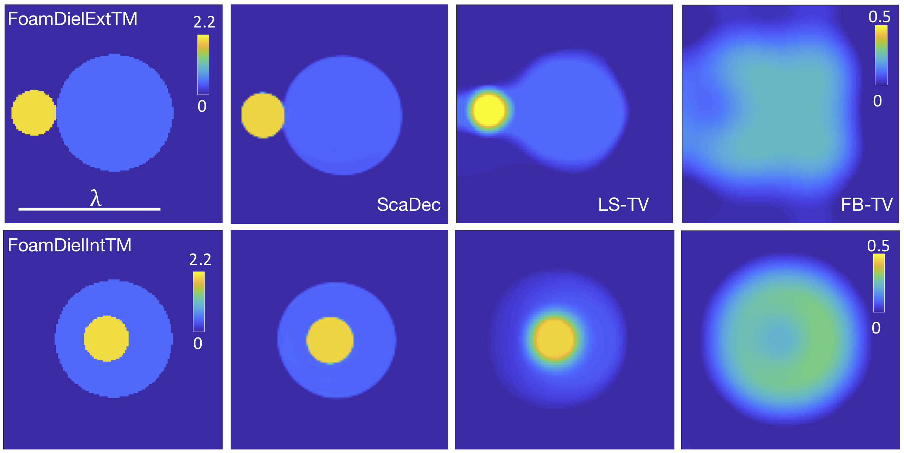

# [Efficient and accurate inversion of multiple scattering with deep learning](https://www.osapublishing.org/oe/abstract.cfm?uri=oe-26-11-14678&origin=search)

This is the python implementation of the deep leraning model [ScaDec](https://www.osapublishing.org/oe/abstract.cfm?uri=oe-26-11-14678&origin=search) for inverting multiple light scattering in a surpervised manner. The [paper](https://www.osapublishing.org/oe/abstract.cfm?uri=oe-26-11-14678&origin=search) is originally published on [Optics Express](https://www.osapublishing.org/oe/home.cfm). The arxiv version of the paper is available [here](https://arxiv.org/abs/1803.06594)

## Abstract
Image reconstruction under multiple light scattering is crucial in a number of applications such as diffraction tomography. The reconstruction problem is often formulated as a nonconvex optimization, where a nonlinear measurement model is used to account for multiple scattering and regularization is used to enforce prior constraints on the object. In this paper, we propose a powerful alternative to this optimization-based view of image reconstruction by designing and training a deep convolutional neural network that can invert multiple scattered measurements to produce a high-quality image of the refractive index. Our results on both simulated and experimental datasets show that the proposed approach is substantially faster and achieves higher imaging quality compared to the state-of-the-art methods based on optimization.

## Experimental Results
The following two figures show the visual results of ScaDec on simulated and experimental datasets ([CelebA](http://mmlab.ie.cuhk.edu.hk/projects/CelebA.html) & [Fresnel](http://iopscience.iop.org/article/10.1088/0266-5611/21/6/S09/meta)). The ScaDec substantially outperforms the optimization-based methods.




## Trianing & Testing
The scripts train.py and test.py are for training and testing the model ScaDec. If you want to train your own ScaDec, please checkout these two files. We also share [**pre-trained model and code here**](https://wustl.box.com/s/kjnpwgg9ktauebolqid41dozyso0q9kz). Please cite the paper if you find our work useful for your research.
The code includes:
```
Generating measurements by solving 2D Lippmann Schwinger Equation
Generating syntheized Gaussian piece-wise smoothed elipses
Generating syntheized circles for Fresnel 2D
Backpropagation
```

To train/test a ScaDec, simply type:

      python train.py
      python test.py

## Environment Requirement
```
Tensorflow v1.4
PIL
Python 3.6
Scipy
```

## Citation
If you find the paper useful in your research, please cite the paper:

      @article{{Sun:18,
      Author = {Yu Sun and Zhihao Xia and Ulugbek S. Kamilov},
      Doi = {10.1364/OE.26.014678},
      Journal = {Opt. Express},
      Keywords = {Image reconstruction techniques; Inverse problems; Tomographic image processing; Inverse scattering},
      Month = {May},
      Number = {11},
      Pages = {14678--14688},
      Publisher = {OSA},
      Title = {Efficient and accurate inversion of multiple scattering with deep learning},
      Url = {http://www.opticsexpress.org/abstract.cfm?URI=oe-26-11-14678},
      Volume = {26},
      Year = {2018},
      Bdsk-Url-1 = {http://www.opticsexpress.org/abstract.cfm?URI=oe-26-11-14678},
      Bdsk-Url-2 = {https://doi.org/10.1364/OE.26.014678}}


## Errata
In the paper, the feature dimension of ScaDec is mistyped in Fig.3. The corrected feature figure is shown here.


      
Thanks Jiaming for pointing out this typo. If you have any concerns about this paper, feel free to contact us: sun.yu@wustl.edu

       
