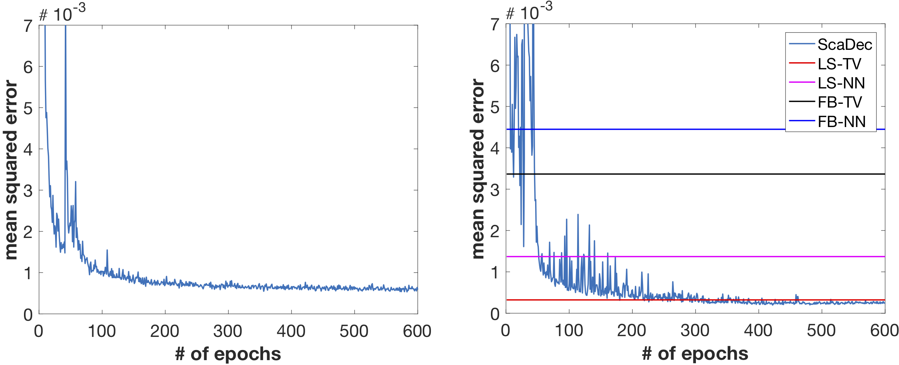

## Efficient and accurate inversion of multiple scattering with deep learning

This is the training code for the deep leraning model [ScaDec](https://www.osapublishing.org/DirectPDFAccess/5EB84514-0152-9CA0-B91D9EDF42DE82BB_389936/oe-26-11-14678.pdf?da=1&id=389936&seq=0&mobile=no) for inverting multiple light scattering in a surpervised manner.
The pdf of the paper is available [here](https://www.osapublishing.org/DirectPDFAccess/5EB84514-0152-9CA0-B91D9EDF42DE82BB_389936/oe-26-11-14678.pdf?da=1&id=389936&seq=0&mobile=no)

Image reconstruction under multiple light scattering is crucial in a number of applications such as diffraction tomography. The reconstruction problem is often formulated as a nonconvex optimization, where a nonlinear measurement model is used to account for multiple scattering and regularization is used to enforce prior constraints on the object. In this paper, we propose a powerful alternative to this optimization-based view of image reconstruction by designing and training a deep convolutional neural network that can invert multiple scattered measurements to produce a high-quality image of the refractive index. Our results on both simulated and experimental datasets show that the proposed approach is substantially faster and achieves higher imaging quality compared to the state-of-the-art methods based on optimization.

If you find the paper useful in your research, please cite the paper:

      @article{{Sun:18,
      Author = {Yu Sun and Zhihao Xia and Ulugbek S. Kamilov},
      Doi = {10.1364/OE.26.014678},
      Journal = {Opt. Express},
      Keywords = {Image reconstruction techniques; Inverse problems; Tomographic image processing; Inverse scattering},
      Month = {May},
      Number = {11},
      Pages = {14678--14688},
      Publisher = {OSA},
      Title = {Efficient and accurate inversion of multiple scattering with deep learning},
      Url = {http://www.opticsexpress.org/abstract.cfm?URI=oe-26-11-14678},
      Volume = {26},
      Year = {2018},
      Bdsk-Url-1 = {http://www.opticsexpress.org/abstract.cfm?URI=oe-26-11-14678},
      Bdsk-Url-2 = {https://doi.org/10.1364/OE.26.014678}}
